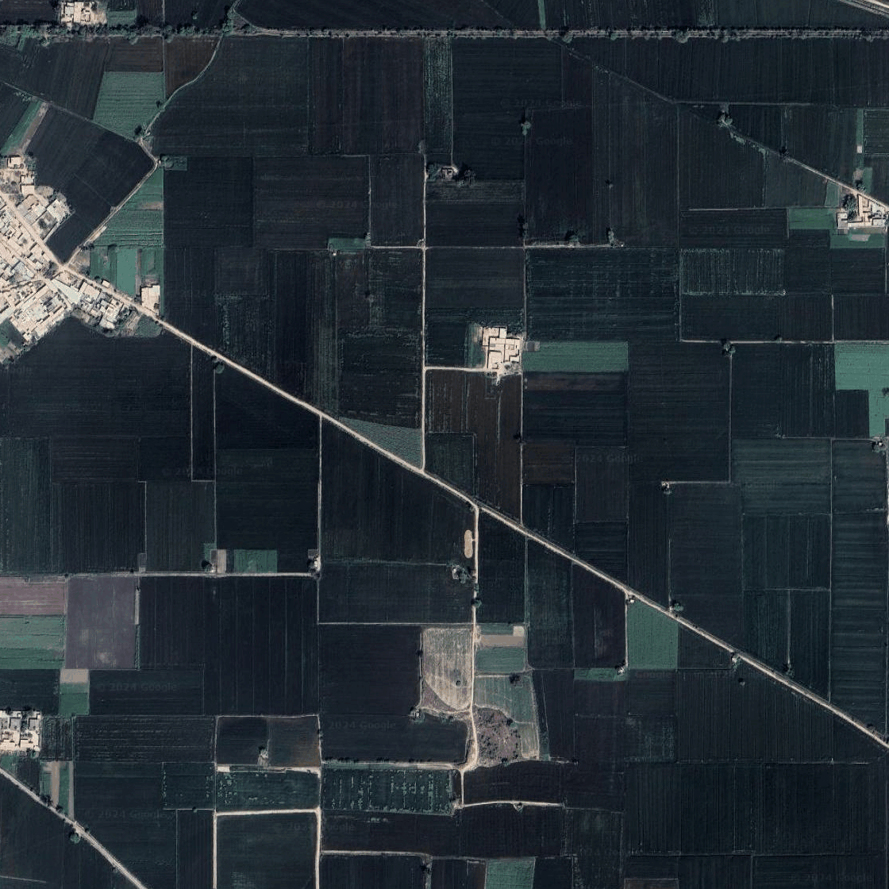
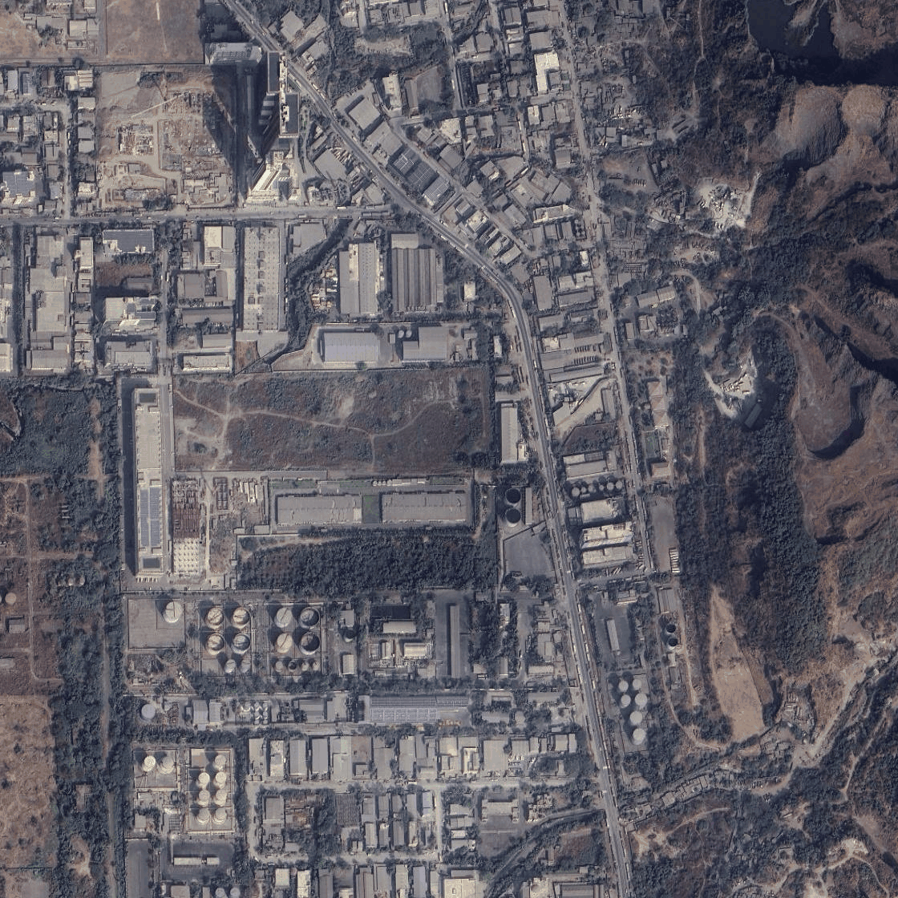
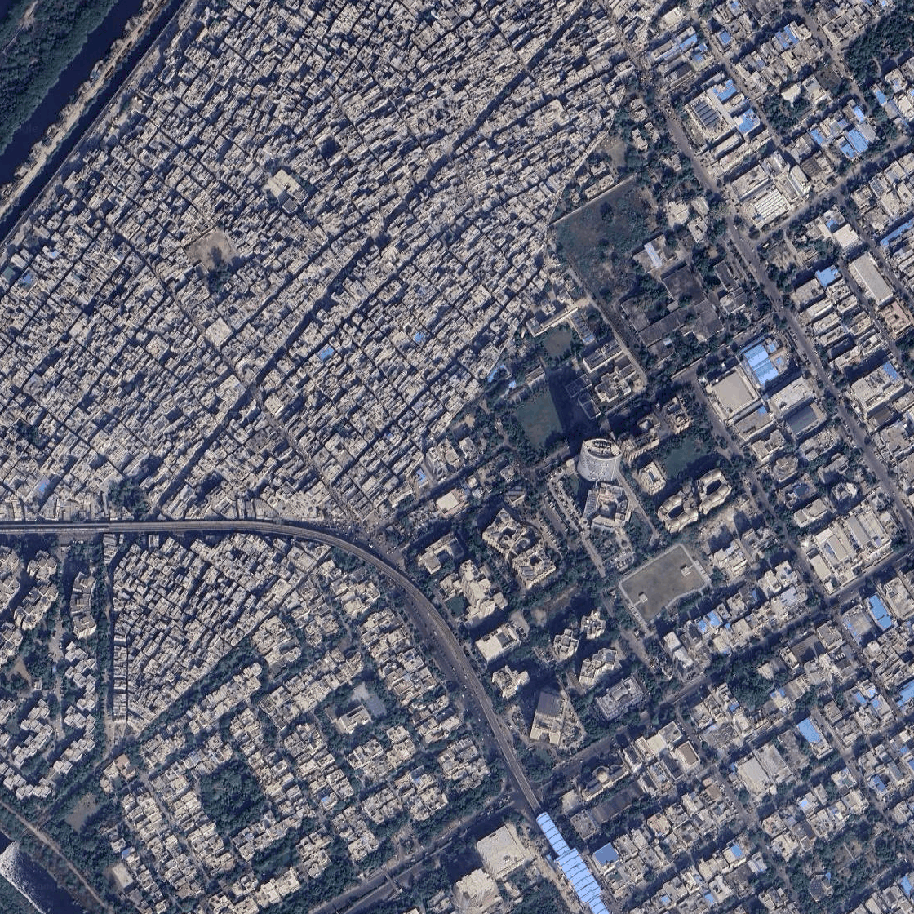

## [Extended Author Response]

- [Reviewer-1/nbj2](#Reviewer-1/nbj2)
- [Reviewer-2/7T6L](#Reviewer-2/7T6L)
- [Reviewer-3/A4cD](#Reviewer-3/A4cD)
- [Reviewer-4/Qbky](#Reviewer-4/Qbky)

### Reviewer-1/nbj2

### Reviewer-2/7T6L

### Reviewer-3/A4cD

> W4: The paper mentions that since power plants and brick kilns usually have chimneys to emit exhaust gas, the algorithm may misdetect this category, so the model is fine-tuned on the power plant dataset, but chemical plants, steel plants, oil refineries, etc., can become one of the confusing data sources, and more dimensions of information can be considered to improve the problem of error detection.

We thank the reviewer for the suggestion. We downloaded 50 images of chemical plants, steel plants, and oil refineries and ran inference on them. The model did not misclassify any of these images as power plants. A few example images are attached here. All images are stored at [`images/negative`](images/negative/).

| | | |
|:-------------------------:|:-------------------------:|:-------------------------:|
||||
||||

### Reviewer-4/Qbky