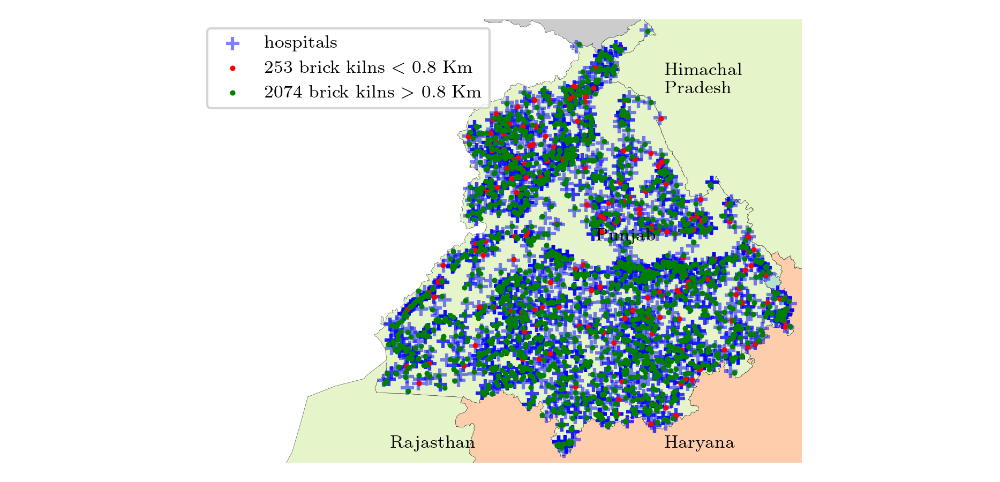

# Extended Author Response

- [Overall response](#overall-response)
    - [Scatter plot of Brick Kilns in IG Plain](#scatter-plot-of-brick-kilns-in-ig-plain)
    - [Number of Brick Kilns Detected per State](#number-of-brick-kilns-detected-per-state)
    - [Population Within K km of Brick Kilns](#population-within-k-km-of-brick-kilns)
- [Reviewer-1/nbj2](#reviewer-1nbj2)
- [Reviewer-2/7T6L](#reviewer-27t6l)
- [Reviewer-3/A4cD](#reviewer-3a4cd)
- [Reviewer-4/Qbky](#reviewer-4qbky)

## Overall response

We thank the reviewers for their constructive and actionable feedback. We want to re-emphasize that our aim in this paper is towards deployability and not novelty. Specifically, we want to target *Data and Benchmarking for Data Science Application Domains (including curation validation and release of large-scale data, experiments, performance benchmarking)* area mentioned in [KDD ADS Scope](https://kdd2024.kdd.org/applied-data-science-ads-track-call-for-papers/).

Brick kilns not only contribute significantly to air pollution [[1](https://link.springer.com/article/10.1007/s11869-012-0187-2)] but as per [[2](https://www.sciencedirect.com/science/article/abs/pii/S1352231014006888)] also employ a large number of labors including children.

We believe that our work and the associated curated datasets, benchmarks, and most importantly compliance studies will further the research in this area.

Based on the reviewers comments, and ongoing deployments, we are happy to share some (revised) statistics and points with the reviewers.

1. Our study encompasses regions in India where 47% of the population resides.

1. We have detected and hand-verified **17167 brick kilns from 9 states** in the Indo-Gangetic plain. We plan to release their exact locations to accelerate research in this direction.

1. We have been extensively working with air quality experts and discussing with pollution control boards who are highly appreciative and plan to incorporate our technologies in their work.

1. We have expanded our compliance study, which is the most important aspect as per various stakeholders, as it leads to specific interventions. We discuss those now. As per pollution control board, the compliance issues are as follows:
    * No two brick kilns should be within 1 km of each other: In our study we found that **50% of the brick kilns are within 1 km of other kiln/kilns**.
    * Brick kilns should be at least 800 m from human habitation. As per our findings, 4% of the population lives within 800 m from brick kilns.
    * Brick kilns should be at least 500 m from rivers. As per our findings, 9% of the brick kilns are within 500 m of rivers.
    * Brick kilns should be at least 800 m from hospitals. As per our findings, 16% of the brick kilns are within 800 m of hospitals.
    * 1.5% of brick kilns violate both the 800 m rule from hospitals and 500 m rule from rivers.

1. Our work is fully reproducible and we have released the [code](https://github.com/rishabh-mondal/kdd24_brick_kilns).

1. We have further segregated the brick kilns based on two types of kilns: Zigzag and FCBK (Fixed Chimney Bull's Trench Kiln). We found that **70% of the brick kilns are Zigzag kilns and rest are FCBK**.

1. We ran [WRF-CAMx](https://www.camx.com/) simulation over Delhi-NCR region for Nov-Dec 2023 and found the brick kilns contribute 8% of PM2.5 pollution in the region.

Following are the detailed statistics and plots for the points mentioned above.

### Scatter plot of Brick Kilns in IG Plain

### Number of Brick Kilns Detected per State

| state            |   # of Brick Kilns |
|:-----------------|-------------------:|
| Uttar Pradesh    |               7510 |
| Haryana          |               2351 |
| Punjab           |               2327 |
| West Bengal      |               2291 |
| Bihar            |               1726 |
| Jharkhand        |                366 |
| uttarakhand      |                233 |
| Madhya Pradesh   |                212 |
| Himachal Pradesh |                151 |
| Total            |              17167 |

### Population within K km of Brick Kilns

|            state |   < 0.8 km |   < 2 km |   < 5 km |   Total Population |
|:-----------------|-----------:|---------:|---------:|-------------------:|
|    Uttar Pradesh |    13.81 M |  63.32 M | 168.83 M |           233.00 M |
|            Bihar |     4.00 M |  19.76 M |  58.08 M |           124.90 M |
|      West Bengal |     4.35 M |  18.54 M |  50.47 M |           102.10 M |
|   Madhya Pradesh |   258.06 K |   1.40 M |   5.84 M |            84.69 M |
|        Jharkhand |   406.06 K |   2.04 M |   8.32 M |            38.94 M |
|           Punjab |     1.95 M |  10.03 M |  25.64 M |            31.04 M |
|          Haryana |     1.12 M |   6.34 M |  19.36 M |            29.63 M |
|      Uttarakhand |   319.41 K |   1.31 M |   3.91 M |            11.64 M |
| Himachal Pradesh |   175.10 K | 680.47 K |   2.11 M |             7.61 M |
|            Total |    26.40 M | 123.42 M | 342.55 M |           663.55 M |

### Contribution of brick kilns to PM2.5 pollution in Delhi-NCR

### Compliance with rivers

#### Punjab

<!-- Fix height with original aspect ratio-->
<!--  -->

#### Haryana

### Compliance with hospitals

#### Punjab

#### Haryana

## Reviewer-1/nbj2

## Reviewer-2/7T6L

## Reviewer-3/A4cD

> W4: The paper mentions that since power plants and brick kilns usually have chimneys to emit exhaust gas, the algorithm may misdetect this category, so the model is fine-tuned on the power plant dataset, but chemical plants, steel plants, oil refineries, etc., can become one of the confusing data sources, and more dimensions of information can be considered to improve the problem of error detection.

We thank the reviewer for the actionable suggestion. We downloaded 36 images including 13 chemical plants, 13 steel plants, and 10 oil refineries and ran inference on them. We observed that the model did not misclassify any of these images as brick kilns. A few example images are attached here. All images are stored at [`images/negative`](images/negative/).

| | | |
|:-------------------------:|:-------------------------:|:-------------------------:|
||||
||||

## Reviewer-4/Qbky