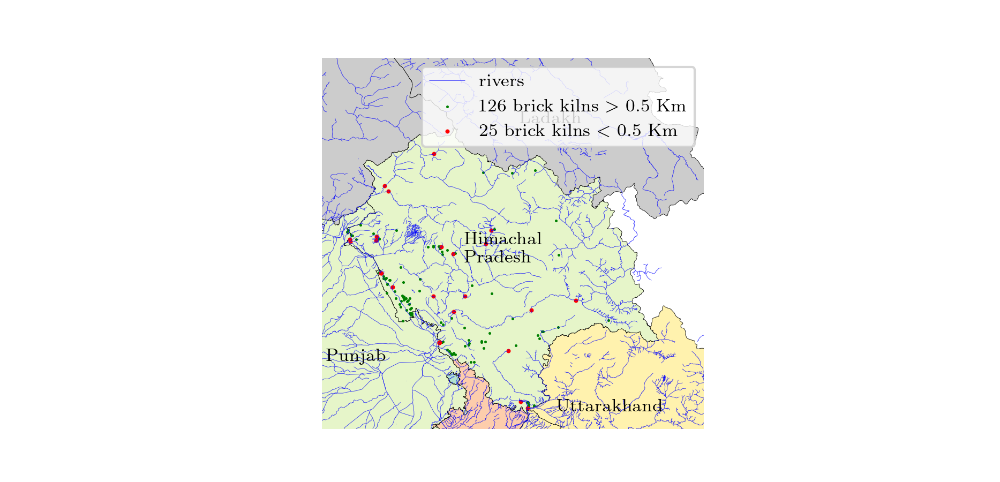
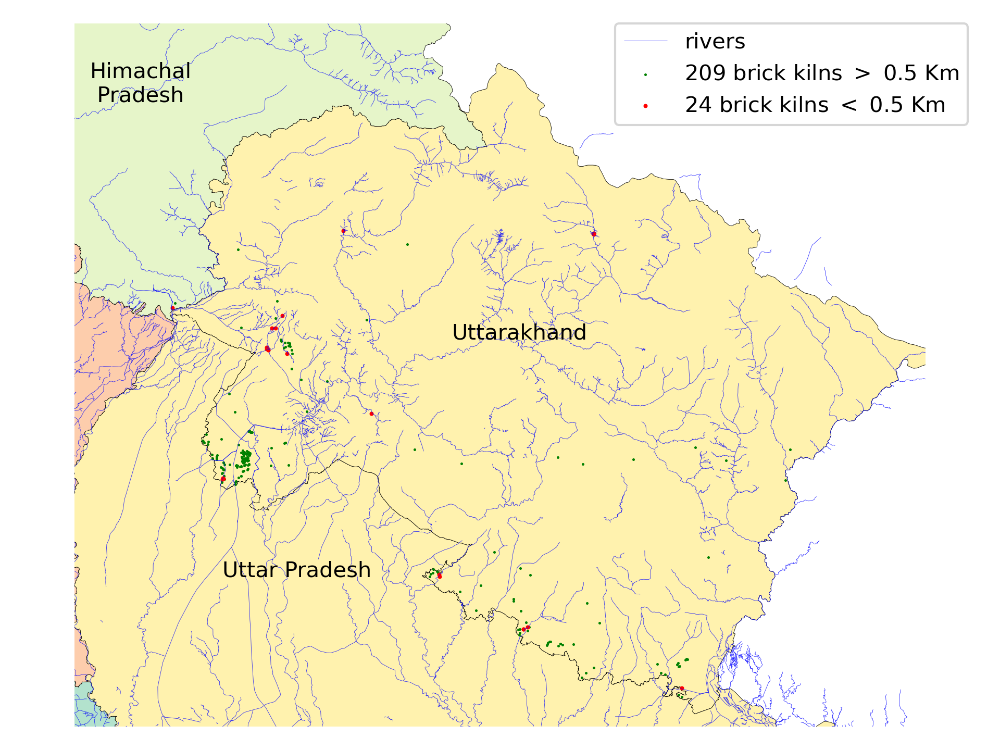
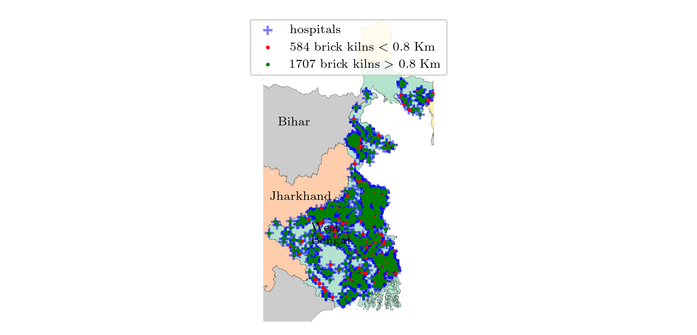
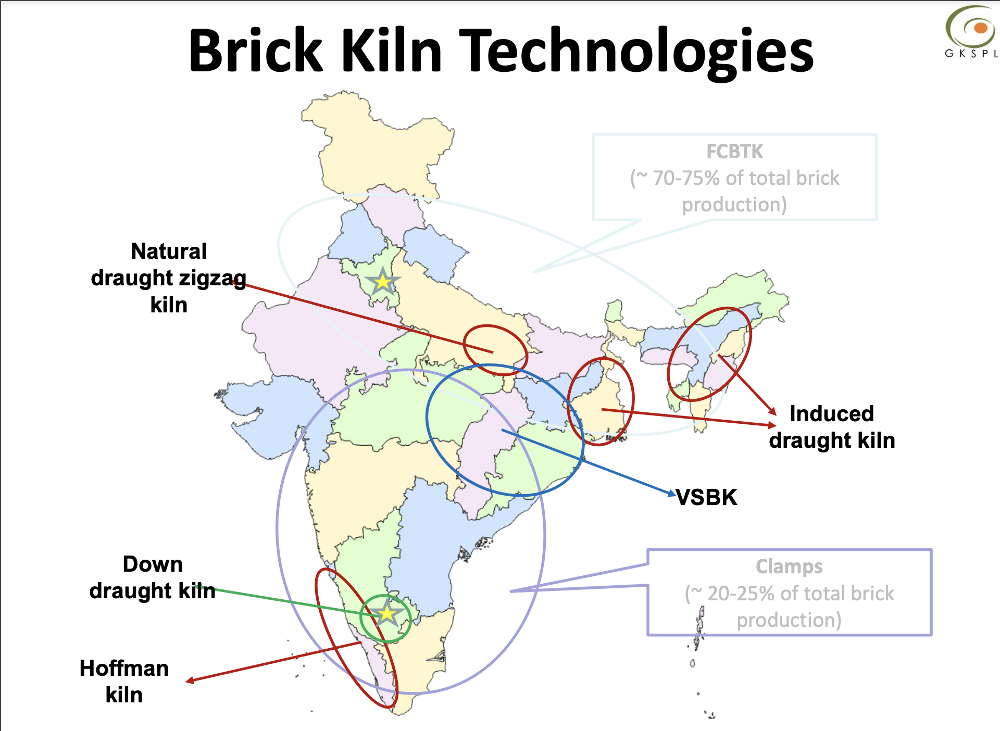

# Extended Author Response

- [Extended Author Response](#extended-author-response)
  - [Overall response](#overall-response)
    - [Models Comparison](#models-comparison)
      - [Zero-shot setting](#zero-shot-setting)
      - [Few-shot setting](#few-shot-setting)
    - [Scatter plot of Brick Kilns in IG Plain](#scatter-plot-of-brick-kilns-in-ig-plain)
      - [Fixed Chimney Bull's Trench Kilns (FCBK)](#fixed-chimney-bulls-trench-kilns-fcbk)
      - [Zigzag Kilns](#zigzag-kilns)
    - [Number of Brick Kilns Detected per State](#number-of-brick-kilns-detected-per-state)
    - [Population within K km of Brick Kilns](#population-within-k-km-of-brick-kilns)
    - [Contribution of brick kilns to PM2.5 pollution in Delhi-NCR](#contribution-of-brick-kilns-to-pm25-pollution-in-delhi-ncr)
    - [Correlation between brick kilns and PM2.5 pollution in Delhi-NCR](#correlation-between-brick-kilns-and-pm25-pollution-in-delhi-ncr)
    - [Estimation of emissions:](#estimation-of-emissions)
      - [Assuming 15000 bricks per day per kiln](#assuming-15000-bricks-per-day-per-kiln)
      - [Assuming 30000 bricks per day per kiln](#assuming-30000-bricks-per-day-per-kiln)
    - [Compliance with rivers](#compliance-with-rivers)
      - [Punjab](#punjab)
      - [Haryana](#haryana)
      - [Uttar Pradesh](#uttar-pradesh)
      - [Bihar](#bihar)
      - [West Bengal](#west-bengal)
      - [Jharkhand](#jharkhand)
      - [Madhya Pradesh](#madhya-pradesh)
      - [Himachal Pradesh](#himachal-pradesh)
      - [Uttarakhand](#uttarakhand)
    - [Compliance with hospitals](#compliance-with-hospitals)
      - [Punjab](#punjab-1)
      - [Haryana](#haryana-1)
      - [Uttar Pradesh](#uttar-pradesh-1)
      - [Bihar](#bihar-1)
      - [West Bengal](#west-bengal-1)
      - [Jharkhand](#jharkhand-1)
      - [Madhya Pradesh](#madhya-pradesh-1)
      - [Himachal Pradesh](#himachal-pradesh-1)
      - [Uttarakhand](#uttarakhand-1)
    - [Negative examples](#negative-examples)
    - [GradCAM integration](#gradcam-integration)
      - [Zigzag images](#zigzag-images)
      - [FCK images](#fck-images)
    - [Brick Kiln Types](#brick-kiln-types)

## Overall response

We thank the reviewers for their constructive and actionable feedback. 

We want to re-emphasize that our aim in this paper is towards deployability and not novelty. Specifically, we want to target the *Data and Benchmarking for Data Science Application Domains (including curation validation and release of large-scale data, experiments, performance benchmarking)* area mentioned in the [KDD ADS Scope](https://kdd2024.kdd.org/applied-data-science-ads-track-call-for-papers/).

Brick kilns not only contribute significantly to air pollution [[1](https://link.springer.com/article/10.1007/s11869-012-0187-2)] but also employ a large number of laborers, including children [[2](https://www.sciencedirect.com/science/article/abs/pii/S1352231014006888)].

We believe that our work and the associated curated datasets, benchmarks, and, most importantly, compliance studies will further the research in this area.

Based on the reviewers' comments and ongoing deployments, we are happy to share some (revised) statistics and points with the reviewers.

1. Based on reviewers' suggestions, we implemented three more SSL methods: 1) [Simsiam](https://arxiv.org/abs/2011.10566); 2) [BYOL](https://arxiv.org/abs/2006.07733); and 3) [Dino](https://arxiv.org/abs/2104.14294). Their performance is comparable or superior to the pre-trained ImageNet model mentioned in the paper.

2. Our study now encompasses regions in India where 47% of the population resides.

3. We have detected and hand-verified **19579 brick kilns from 9 states** in the Indo-Gangetic plain. We plan to release their exact locations to accelerate research in this direction.

4. We have been extensively working with air quality experts and discussing with pollution control boards who are highly appreciative and plan to incorporate our technologies in their work.

5. We have expanded our compliance study, which is the most important aspect as per various stakeholders, as it leads to specific interventions. We discuss those now. As per the pollution control board, the compliance issues are as follows:
    * No two brick kilns should be within 1 km of each other: In our study, we found that **9777 (about 50%) of the brick kilns are within 1 km of other kiln/kilns**.
    * Brick kilns should be at least 800 m from human habitation. As per our findings, 31.82 million people (4.8% of the population in the region of study) live within 800 m of brick kilns.
    * Brick kilns should be at least 500 m from rivers. As per our findings, 1765 (9%) of the brick kilns are within 500 m of rivers.
    * Brick kilns should be at least 800 m from hospitals. As per our findings, 3057 (16%) of the brick kilns are within 800 m of hospitals.
    * 270 (1.4%) of brick kilns violate both the 800 m rule from hospitals and the 500 m rule from rivers.

6. We have further segregated the brick kilns based on the two most common brick kiln types in India: Zigzag and FCBK (Fixed Chimney Bull's Trench Kiln). We found that **71% of the brick kilns are Zigzag kilns and the rest are FCBK**. Zigzag is 40% more efficient than FCBK in terms of emissions [[Guttikunda et al.](https://link.springer.com/article/10.1007/s11869-012-0187-2)].

7. With our updated emission inventory including the identified brick kilns, we ran a Chemical Transport Model (CTM), [WRF-CAMx](https://www.camx.com/) over the Delhi-NCR region for Nov-Dec 2023 with the help of an air quality expert and found that brick kilns contribute 8% of PM2.5 pollution in the region.

8. We estimate PM2.5 emissions from brick kilns to be 1428 to 2856 tons per day. If all FCBK kilns are converted to Zigzag, this range will reduce to 1198 to 2396 tons per day i.e. a reduction of 16%. If all the kilns are converted to Hoffman kilns [[Guttikunda et al.](https://link.springer.com/article/10.1007/s11869-012-0187-2)], the range will reduce to 200 to 400 tons per day i.e. a reduction of 86%.

9. We have integrated GradCAM with our model to highlight the areas of brick kilns where the model focuses to make the prediction.

10.   Our work is fully reproducible and we have released the [code](https://github.com/rishabh-mondal/kdd24_brick_kilns).

Following are the detailed statistics and plots to support the points mentioned above.

### Models Comparison

All models have EfficientNet B0 as the backbone and are tested on 50% holdout data from Delhi-NCR.

#### Zero-shot setting
| SSL     | Pretrain | Fine-tune  | Precision | Recall |       F1 |
| :------ | :------- | :--------- | --------: | -----: | -------: |
| BYOL    | -        | Bangladesh |      0.77 |   0.76 | **0.77** |
| DINO    | -        | Bangladesh |      0.64 |   0.94 |     0.76 |
| Simsiam | -        | Bangladesh |      0.64 |   0.90 |     0.75 |
| -       | ImageNet | Bangladesh |      0.87 |   0.66 |     0.75 |

#### Few-shot setting
| SSL     | Pretrain | Fine-tune             | Precision | Recall |       F1 |
| :------ | :------- | :-------------------- | --------: | -----: | -------: |
| Simsiam | -        | Bangladesh + 5% Delhi |      0.75 |   0.90 | **0.82** |
| BYOL    | -        | Bangladesh + 5% Delhi |      0.85 |   0.77 |     0.81 |
| -       | ImageNet | Bangladesh + 5% Delhi |      0.77 |   0.80 |     0.78 |
| DINO    | -        | Bangladesh + 5% Delhi |      0.64 |   0.94 |     0.76 |

### Scatter plot of Brick Kilns in IG Plain

#### Fixed Chimney Bull's Trench Kilns (FCBK)

#### Zigzag Kilns

### Number of Brick Kilns Detected per State

| state            | # of Zigzag | # of FCBK | Total |
| :--------------- | ----------: | --------: | ----: |
| Uttar Pradesh    |        4174 |      3336 |  7510 |
| Bihar            |        3455 |       683 |  4138 |
| Haryana          |        2214 |       137 |  2351 |
| Punjab           |        2045 |       282 |  2327 |
| West Bengal      |        1626 |       665 |  2291 |
| Jharkhand        |          57 |       309 |   366 |
| Uttarakhand      |         164 |        69 |   233 |
| Madhya Pradesh   |          73 |       139 |   212 |
| Himachal Pradesh |         133 |        18 |   151 |
| Total            |       13941 |      5638 | 19579 |

### Population within K km of Brick Kilns

| state            | < 0.8 km |   < 2 km |   < 5 km | Total Population |
| :--------------- | -------: | -------: | -------: | ---------------: |
| Uttar Pradesh    |  13.81 M |  63.32 M | 168.83 M |         233.00 M |
| Bihar            |   9.43 M |  44.22 M |  98.41 M |         124.90 M |
| West Bengal      |   4.35 M |  18.54 M |  50.47 M |         102.10 M |
| Madhya Pradesh   | 258.06 K |   1.40 M |   5.84 M |          84.69 M |
| Jharkhand        | 406.06 K |   2.04 M |   8.32 M |          38.94 M |
| Punjab           |   1.95 M |  10.03 M |  25.64 M |          31.04 M |
| Haryana          |   1.12 M |   6.34 M |  19.36 M |          29.63 M |
| Uttarakhand      | 319.41 K |   1.31 M |   3.91 M |          11.64 M |
| Himachal Pradesh | 175.10 K | 680.47 K |   2.11 M |           7.61 M |
| Total            |  31.82 M | 147.88 M | 382.88 M |         663.55 M |

### Contribution of brick kilns to PM2.5 pollution in Delhi-NCR

### Correlation between brick kilns and PM2.5 pollution in Delhi-NCR
We get the brick kilns specific PM2.5 concentrations from the Chemical Transport Model CAMx and show the following animation over Delhi-NCR region.

### Estimation of emissions:
We get the following emission factors (g/brick) from [[Guttikunda et al., 2012](https://link.springer.com/article/10.1007/s11869-012-0187-2)]: {"PM2.5": 6.8, "PM10": 9.7, "SO2": 4.6, "NOx": 4.7, "CO": 90.0, "CO2": 520, "BC": 2.8}

The small-scale kilns make less than 15000 bricks per day, while the large-scale kilns make more than 30000 bricks per day [[Guttikunda et al., 2012](https://link.springer.com/article/10.1007/s11869-012-0187-2)]. Thus, we computed emissions for 15000 and 30000 bricks per day per kiln to obtain a range of emissions.

#### Assuming 15000 bricks per day per kiln
Emissions in tons per day.

|                  |   PM2.5 |    PM10 |    SO2 |    NOx |      CO |     CO2 |     BC |   Total |
| :--------------- | ------: | ------: | -----: | -----: | ------: | ------: | -----: | ------: |
| Bihar            |  281.11 |     401 | 190.16 |  194.3 |  3720.6 | 21496.8 | 115.75 | 26399.7 |
| Haryana          |  149.47 |  213.22 | 101.11 | 103.31 | 1978.29 | 11430.1 |  61.55 | 14037.1 |
| Himachal Pradesh |    9.98 |   14.23 |   6.75 |   6.89 |  132.03 |  762.84 |   4.11 |  936.83 |
| Jharkhand        |   35.01 |   49.94 |  23.68 |   24.2 |  463.32 | 2676.96 |  14.41 | 3287.51 |
| Madhya Pradesh   |   18.65 |    26.6 |  12.61 |  12.89 |  246.78 | 1425.84 |   7.68 | 1751.04 |
| Punjab           |  153.92 |  219.56 | 104.12 | 106.38 | 2037.15 | 11770.2 |  63.38 | 14454.7 |
| Uttar Pradesh    |  595.72 |  849.78 | 402.99 | 411.75 | 7884.54 | 45555.1 |  245.3 | 55945.2 |
| Uttarakhand      |   17.07 |   24.36 |  11.55 |   11.8 |  225.99 | 1305.72 |   7.03 | 1603.52 |
| West Bengal      |  167.34 |  238.71 |  113.2 | 115.66 | 2214.81 | 12796.7 |  68.91 | 15715.3 |
| Total            | 1428.27 | 2037.38 | 966.18 | 987.18 | 18903.5 |  109220 | 588.11 |  134131 |

#### Assuming 30000 bricks per day per kiln
Emissions in tons per day.

|                  |   PM2.5 |    PM10 |     SO2 |     NOx |      CO |     CO2 |      BC |   Total |
| :--------------- | ------: | ------: | ------: | ------: | ------: | ------: | ------: | ------: |
| Bihar            |  562.22 |     802 |  380.33 |   388.6 |  7441.2 | 42993.6 |   231.5 | 52799.4 |
| Haryana          |  298.94 |  426.43 |  202.23 |  206.62 | 3956.58 | 22860.2 |  123.09 | 28074.1 |
| Himachal Pradesh |   19.95 |   28.46 |    13.5 |   13.79 |  264.06 | 1525.68 |    8.22 | 1873.65 |
| Jharkhand        |   70.01 |   99.87 |   47.36 |   48.39 |  926.64 | 5353.92 |   28.83 | 6575.03 |
| Madhya Pradesh   |   37.29 |   53.19 |   25.23 |   25.77 |  493.56 | 2851.68 |   15.36 | 3502.08 |
| Punjab           |  307.84 |  439.12 |  208.24 |  212.77 |  4074.3 | 23540.4 |  126.76 | 28909.4 |
| Uttar Pradesh    | 1191.44 | 1699.56 |  805.98 |   823.5 | 15769.1 | 91110.2 |  490.59 |  111890 |
| Uttarakhand      |   34.15 |   48.71 |    23.1 |    23.6 |  451.98 | 2611.44 |   14.06 | 3207.05 |
| West Bengal      |  334.68 |  477.41 |   226.4 |  231.32 | 4429.62 | 25593.4 |  137.81 | 31430.6 |
| Total            | 2856.53 | 4074.76 | 1932.36 | 1974.37 |   37807 |  218441 | 1176.22 |  268262 |

### Compliance with rivers

#### Punjab

#### Haryana

#### Uttar Pradesh

#### Bihar

#### West Bengal

#### Jharkhand

#### Madhya Pradesh

#### Himachal Pradesh

#### Uttarakhand

### Compliance with hospitals

#### Punjab

#### Haryana

#### Uttar Pradesh

#### Bihar

#### West Bengal

#### Jharkhand

#### Madhya Pradesh

#### Himachal Pradesh

#### Uttarakhand

### Negative examples
The following are some of the negative examples where the model may get confused because of a chimney in the image.

|                                      |                                      |                                      |
| :----------------------------------: | :----------------------------------: | :----------------------------------: |
|  |  |  |
|  |  |  |

### GradCAM integration
We integrate GradCAM with our model to show that model focuses on the brick kiln area to make the prediction. The following are some of the examples.

#### Zigzag images
The model mostly focuses on both ends of the combustion chamber in the Zigzag kilns.
|                                        |                                        |
| :------------------------------------: | :------------------------------------: |
|  |  |
|  |  |

#### FCK images
The model mostly focuses on the corners of the kiln in the FCK kilns.

|                                     |                                     |
| :---------------------------------: | :---------------------------------: |
|   |  |
|  |  |

### Brick Kiln Types
Screenshots are taken from [here](https://www.brookings.edu/wp-content/uploads/2016/10/guttikunda-iaqi-pps-and-bricks.pdf).

