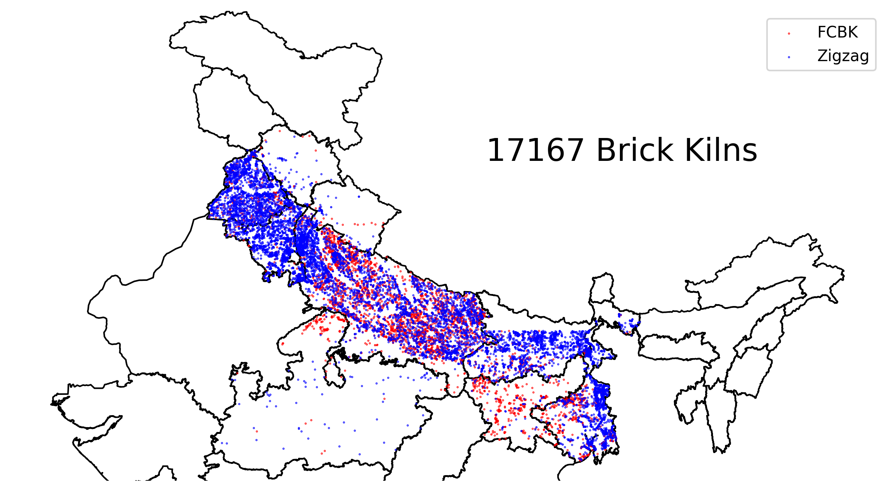

## Extended Author Response

- [Overall response](#overall-response)
    - [Scatter plot of Brick Kilns in IG Plain](#scatter-of-brick-kilns-in-indo-gangetic-plain)
    - [Number of Brick Kilns Detected per State](#number-of-brick-kilns-detected-per-state)
    - [Population Within K km of Brick Kilns](#population-within-k-km-of-brick-kilns)
- [Reviewer-1/nbj2](#reviewer-1nbj2)
- [Reviewer-2/7T6L](#reviewer-27t6l)
- [Reviewer-3/A4cD](#reviewer-3a4cd)
- [Reviewer-4/Qbky](#reviewer-4qbky)

### Overall response

#### Scatter plot of Brick Kilns in IG Plain

#### Number of Brick Kilns Detected per State

| state            |   # of Brick Kilns |
|:-----------------|-------------------:|
| Uttar Pradesh    |               7510 |
| Haryana          |               2351 |
| Punjab           |               2327 |
| West Bengal      |               2291 |
| Bihar            |               1726 |
| Jharkhand        |                366 |
| uttarakhand      |                233 |
| Madhya Pradesh   |                212 |
| Himachal Pradesh |                151 |
| Total            |              17167 |

#### Population within K km of Brick Kilns

|            state |   < 0.8 km |   < 2 km |   < 5 km |   Total Population |
|:-----------------|-----------:|---------:|---------:|-------------------:|
|    Uttar Pradesh |    13.81 M |  63.32 M | 168.83 M |           233.00 M |
|            Bihar |     4.00 M |  19.76 M |  58.08 M |           124.90 M |
|      West Bengal |     4.35 M |  18.54 M |  50.47 M |           102.10 M |
|   Madhya Pradesh |   258.06 K |   1.40 M |   5.84 M |            84.69 M |
|        Jharkhand |   406.06 K |   2.04 M |   8.32 M |            38.94 M |
|           Punjab |     1.95 M |  10.03 M |  25.64 M |            31.04 M |
|          Haryana |     1.12 M |   6.34 M |  19.36 M |            29.63 M |
|      Uttarakhand |   319.41 K |   1.31 M |   3.91 M |            11.64 M |
| Himachal Pradesh |   175.10 K | 680.47 K |   2.11 M |             7.61 M |
|            Total |    26.40 M | 123.42 M | 342.55 M |           663.55 M |

#### Compliance with rivers

##### Punjab

<!-- Fix height with original aspect ratio-->
<!--  -->

##### Haryana

#### Compliance with hospitals

##### Punjab

##### Haryana

### Reviewer-1/nbj2

### Reviewer-2/7T6L

### Reviewer-3/A4cD

> W4: The paper mentions that since power plants and brick kilns usually have chimneys to emit exhaust gas, the algorithm may misdetect this category, so the model is fine-tuned on the power plant dataset, but chemical plants, steel plants, oil refineries, etc., can become one of the confusing data sources, and more dimensions of information can be considered to improve the problem of error detection.

We thank the reviewer for the actionable suggestion. We downloaded 36 images including 13 chemical plants, 13 steel plants, and 10 oil refineries and ran inference on them. We observed that the model did not misclassify any of these images as brick kilns. A few example images are attached here. All images are stored at [`images/negative`](images/negative/).

| | | |
|:-------------------------:|:-------------------------:|:-------------------------:|
||||
||||

### Reviewer-4/Qbky